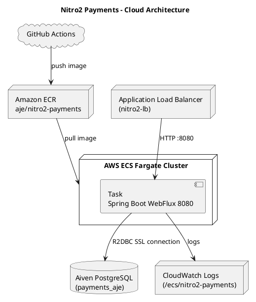

# 🚀 Nitro2 Payments API

API backend **reactiva** desarrollada con **Spring Boot WebFlux + R2DBC (PostgreSQL)**, desplegada en **AWS ECS Fargate** y automatizada con **GitHub Actions**.  
Este proyecto replica un flujo profesional de integración y despliegue continuo (CI/CD) para una aplicación de pagos escalable y segura.

---

## 🧩 Stack Tecnológico

| Componente | Tecnología / Servicio |
|-------------|------------------------|
| Lenguaje | Java 17 |
| Framework | Spring Boot 3 (WebFlux + Actuator) |
| ORM Reactivo | Spring Data R2DBC |
| Base de Datos | PostgreSQL (Aiven Cloud) |
| Cloud Provider | AWS |
| Contenedor | Docker |
| Orquestación | ECS Fargate |
| Registro de imágenes | ECR |
| Balanceador | Application Load Balancer (ALB) |
| Logs | CloudWatch |
| CI/CD | GitHub Actions |

---

## ⚙️ Estructura del Proyecto

```
nitro2-payments-api/
├── src/
│   ├── main/java/org/example/
│   │   ├── controller/PaymentController.java
│   │   ├── service/PaymentService.java
│   │   ├── repository/PaymentRepository.java
│   │   └── model/Payment.java
│   └── resources/application.yml
├── Dockerfile
├── pom.xml
└── README.md
```

---

## 💻 Ejecución Local

1. Clonar el repositorio
   ```bash
   git clone https://github.com/<usuario>/nitro2-payments-api.git
   cd nitro2-payments-api
   ```

2. Crear base de datos (opcional) y actualizar `application.yml`:
   ```yaml
   spring:
     r2dbc:
       url: r2dbc:postgresql://<host>:<port>/<database>
       username: <usuario>
       password: <clave>
   ```

3. Ejecutar en local:
   ```bash
   ./mvnw spring-boot:run
   ```

4. Acceder al Swagger local:  
   👉 [http://localhost:8080/webjars/swagger-ui/index.html](http://localhost:8080/webjars/swagger-ui/index.html)

---

## ☁️ Despliegue en AWS (ECS + Fargate)

### 1️⃣ Crear rol de ejecución para ECS

```bash
aws iam create-role   --role-name ecsTaskExecutionRole   --assume-role-policy-document file://trust-policy.json
```

### 2️⃣ Adjuntar políticas necesarias

```bash
aws iam attach-role-policy --role-name ecsTaskExecutionRole --policy-arn arn:aws:iam::aws:policy/service-role/AmazonECSTaskExecutionRolePolicy
aws iam attach-role-policy --role-name ecsTaskExecutionRole --policy-arn arn:aws:iam::aws:policy/CloudWatchLogsFullAccess
```

### 3️⃣ Construir y subir imagen a ECR

```bash
aws ecr get-login-password --region us-east-1 | docker login --username AWS --password-stdin 148761658682.dkr.ecr.us-east-1.amazonaws.com

docker build -t nitro2-payments .
docker tag nitro2-payments:latest 148761658682.dkr.ecr.us-east-1.amazonaws.com/aje/nitro2-payments:latest
docker push 148761658682.dkr.ecr.us-east-1.amazonaws.com/aje/nitro2-payments:latest
```

*(Esto también puede automatizarse con GitHub Actions)*

### 4️⃣ Crear cluster y servicio ECS

```bash
aws ecs create-cluster --cluster-name nitro2-cluster
```

### 5️⃣ Crear definición de tarea (task definition)

Ejemplo:
```json
{
  "family": "nitro2-payments-task",
  "executionRoleArn": "arn:aws:iam::148761658682:role/ecsTaskExecutionRole",
  "networkMode": "awsvpc",
  "requiresCompatibilities": ["FARGATE"],
  "cpu": "256",
  "memory": "512",
  "containerDefinitions": [
    {
      "name": "nitro2-payments",
      "image": "148761658682.dkr.ecr.us-east-1.amazonaws.com/aje/nitro2-payments:latest",
      "portMappings": [{ "containerPort": 8080, "protocol": "tcp" }],
      "logConfiguration": {
        "logDriver": "awslogs",
        "options": {
          "awslogs-group": "/ecs/nitro2-payments",
          "awslogs-region": "us-east-1",
          "awslogs-stream-prefix": "ecs"
        }
      }
    }
  ]
}
```

Registrar la definición:
```bash
aws ecs register-task-definition --cli-input-json file://taskdef.json
```

### 6️⃣ Crear grupo de destino (Target Group)

```bash
aws elbv2 create-target-group   --name nitro2-targets   --protocol HTTP   --port 8080   --vpc-id <VPC_ID>   --target-type ip   --health-check-path "/health"   --health-check-port "8080"
```

### 7️⃣ Crear load balancer y listener

```bash
aws elbv2 create-load-balancer   --name nitro2-lb   --subnets <subnet-a> <subnet-b>   --security-groups <sg-id>

aws elbv2 create-listener   --load-balancer-arn <ALB_ARN>   --protocol HTTP   --port 80   --default-actions Type=forward,TargetGroupArn=<TG_ARN>
```

### 8️⃣ Crear el servicio ECS

```bash
aws ecs create-service   --cluster nitro2-cluster   --service-name nitro2-service   --task-definition nitro2-payments-task   --desired-count 1   --launch-type FARGATE   --network-configuration "awsvpcConfiguration={subnets=[<subnet-a>,<subnet-b>],securityGroups=[<sg-id>],assignPublicIp=ENABLED}"   --load-balancers "targetGroupArn=<TG_ARN>,containerName=nitro2-payments,containerPort=8080"
```

### 9️⃣ Verificar estado

```bash
aws ecs describe-tasks --cluster nitro2-cluster
aws elbv2 describe-target-health --target-group-arn <TG_ARN>
```

✅ Estado esperado: `"TargetHealth": { "State": "healthy" }`

---

## 🌐 Acceso final

Una vez saludable, accede vía:

**Swagger:**  
👉 http://<ALB_DNS>/webjars/swagger-ui/index.html

**Health Check:**  
👉 http://<ALB_DNS>/health

---

## 🧱 Diagrama Arquitectónico (ASCII)

```
[GitHub Actions] → [Amazon ECR] → [ECS Fargate Task] → [Aiven PostgreSQL]
                              │
                            [ALB]
                              │
                         [Internet Clients]
```

Más detallado:

```
User ──► ALB (HTTP:80)
           │
           ▼
     Target Group (8080)
           │
           ▼
   ECS Fargate Task
   ├─ Spring Boot WebFlux (8080)
   ├─ R2DBC PostgreSQL (SSL)
   └─ CloudWatch Logs
```

---

## 🧩 Diagrama PlantUML



---

## 🧾 Referencias útiles

- [Spring WebFlux Documentation](https://docs.spring.io/spring-framework/reference/web/webflux.html)
- [AWS ECS Fargate User Guide](https://docs.aws.amazon.com/AmazonECS/latest/developerguide/Welcome.html)
- [AWS Load Balancer Health Checks](https://docs.aws.amazon.com/elasticloadbalancing/latest/application/target-group-health-checks.html)

---

**Autor:** Jhosep Romero  
**Empresa:** AJE Group (Simulación técnica)  
**Fecha:** 2025-10-22
